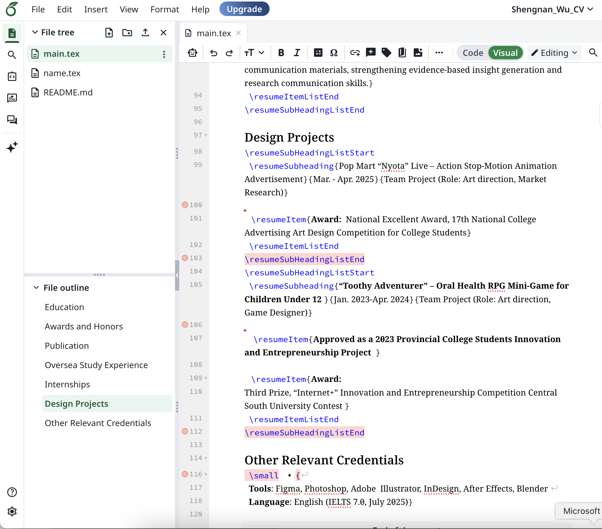

# why-are-we-here
Assignment 1 — "Why are we here?" 

When AI can turn a short sentence into working code, learning to program can seem strangely unnecessary. The more important question, however, is not whether AI can produce code, but what role humans should play in the process. For me, the answer is that programming helps me understand and control the medium I am using. AI can be my collaborator, but it cannot completely replace my judgement.

As a research student, I may need programming to analyse data. An AI assistant such as Codex can generate a data-analysis script quickly, but I still need to know whether the code answers my research question and processes the data correctly. If I do not understand the basic logic, I may not be able to recognise an error or explain why the result is wrong. AI can produce code, but I still need to read, judge and modify it.

I experienced this recently when I used Overleaf to make my CV. I copied a template from GitHub and asked Codex to replace the original information with my own. The first version was mostly usable. Later, I wanted to add more experience, so I edited the file directly. However, I knew almost nothing about LaTeX and did not understand why symbols such as curly brackets were necessary. After my changes, the document stopped compiling and the screen filled with error messages.

<em>This is the modified LaTeX code, which still contains some errors.</em>

This experience showed me that having an AI agent does not mean I can completely stop thinking. Codex helped me create the first version, but it could not remove my responsibility as the user. I had to compare the broken version with the original code and gradually work out what the different symbols meant. It took me an entire afternoon to fix the CV. Although this was frustrating, solving the problem gave me a strong sense of achievement. I realised that even basic programming knowledge would allow me to work with AI more efficiently. Instead of asking AI to repair something I did not understand, I could identify the problem and give more precise instructions.

Every industry has its own language. Designers need to understand visual language, researchers need to understand the language of data, and programmers need to understand code. If I do not understand code at all, I can only describe my wishes to AI without truly controlling the process. AI may generate something that appears correct, but it does not necessarily understand my research purpose, design intention or personal preferences. Learning programming gives me a way to communicate with this medium more precisely. It also helps me decide which parts of a project come from my own intentions and which parts are simply the AI’s assumptions.

For this reason, programming is connected to authorship. Being the author of a work does not necessarily mean writing every line of code by hand. It means understanding the important decisions, judging the results and taking responsibility for the final work. If I understand how a system operates, I can change its rules, parameters and outcomes. I can collaborate with AI while still keeping my own judgement and creative identity.

When I first learned Photoshop and Adobe Illustrator, I spent many hours doing small exercises. I worked slowly and made mistakes, but I enjoyed the feeling of creating something myself. Since AI image generators became popular, this feeling has become more complicated. A few prompts can now produce images that might previously have taken hours to make. This is convenient, but it can also make me less willing to experiment with composition, colour and form. The speed of the result can replace the slower satisfaction of learning.

During the first workshop, I struggled to follow the process. After returning home, I repeated the steps until I understood them. The difficulty was tiring, but it also gave me the excitement of learning something new. Only through thinking and practising for myself can I continue learning and maintain my enthusiasm for creating.

 [Dylan Beattie’s The Art of Code](https://www.youtube.com/watch?v=6avJHaC3C2U) also inspired me. It makes me realize that programming not only as a technical process, but also as a form of expression. Code can generate images, music, patterns and unexpected behaviours. It can be playful and personal, giving me the opportunity to create with code and experience the same sense of achievement I felt before.

Therefore, learning programming allows me to understand and control the medium I use. It helps me judge AI-generated code, correct mistakes and take responsibility for my creative decisions. Whether I create a research tool, a small useless program or a piece of coding art, I want to remain actively involved in the process. Even if AI continues to become more capable, I still want to understand enough to create, question and make something that feels genuinely mine.

References

Beattie, D. (n.d.). The Art of Code. https://www.youtube.com/watch?v=6avJHaC3C2U
